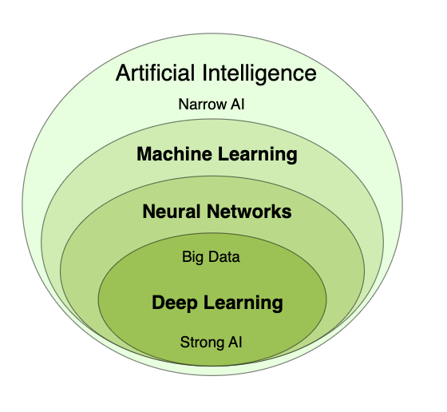

# Documentation

- [Machine Learning](#machine-learning)
  - [Perceptrons](#perceptrons)
  - [Neural Networks](#neural-networks)
  - [Deep Neural Networks](#deep-neural-networks)
  - [Examples](#examples)

### Credits:

- [W3School](https://www.w3schools.com/ai/default.asp)
- [Simplilearn](https://www.simplilearn.com/tutorials/machine-learning-tutorial/what-is-epoch-in-machine-learning)
- [OpenAI](https://platform.openai.com/docs)

## Machine Learning

Traditional programming uses known algorithms to produce results from data:

Data + Algorithms = Results

Machine learning creates new algorithms from data and results:

Data + Results = Algorithms



Artificial Intelligence (AI) is an umbrella term for computer software that mimics human cognition in order to perform complex tasks and learn from them.

Machine learning (ML) is a subfield of AI that uses algorithms trained on data to produce adaptable models that can perform a variety of complex tasks.

Deep learning is a subset of machine learning that uses several layers within neural networks to do some of the most complex ML tasks without any human intervention.

In order to understand how ML works, firstly we need to learn how neural networks work.

### Perceptrons

The Perceptron defines the first step into Neural Networks. It represents a single neuron with only one input layer, and no hidden layers.

### Neural Networks

Neural Networks are Multi-Layer Perceptrons. Meaning each neural is connected to each other to perform more complex tasks.


Yellow nodes are the first perceptrons which is performing a simple decision. Once decision is made, its being passed through the next perceptron layer. Blue nodes will perform further decisions to have an accurate result.

### Deep Neural Networks

Deep Neural Networks are another layer in the network that performs even further decision in the network.

### Epoch and Batch in Machine Learning

Each time a dataset passes through an algorithm, it is said to have completed an epoch. Therefore, Epoch, in machine learning, refers to the one entire passing of training data through the algorithm. It's a hyperparameter that determines the process of training the machine learning model.

The training data is always broken down into small batches to overcome the issue that could arise due to storage space limitations of a computer system. These smaller batches can be easily fed into the machine learning model to train it. This process of breaking it down to smaller bits is called batch in machine learning. This procedure is known as an epoch when all the batches are fed into the model to train at once.

An epoch is when all the training data is used at once and is defined as the total number of iterations of all the training data in one cycle for training the machine learning model.

Another way to define an epoch is the number of passes a training dataset takes around an algorithm. One pass is counted when the data set has done both forward and backward passes.

Let's explain Epoch with an example. Consider a dataset that has 200 samples. These samples take 1000 epochs or 1000 turns for the dataset to pass through the model. It has a batch size of 5. This means that the model weights are updated when each of the 40 batches containing five samples passes through. Hence the model will be updated 40 times.

### Neural Networks Examples

We will be using some JavaScript libraries to hide the complexity of the mathematics in order to use ML and AI. Yet understanding the basics will help to use those libraries.

- [How to build a Neural Network with brain.js](./ML/brainjs/app.js)
- [How to build a Neural Network with ml5js](./ML/ml5/app.js)

## OpenAI

OpenAI is a company that exposes their trained models through Rest API.

The APIs are accessible to public and can be used with pay as you go pricing model.

They also expose a public AI Tool (ChatGPT) which can be used for free. [Try it out!](https://chat.openai.com/)

What models are available on OpenAI?

- GPT-4 is a large multimodal model (accepting text or image inputs and outputting text) that can solve difficult problems

- DALL·E is a model that can generate and edit images given a natural language prompt

- TTS is a set of models that can convert text into natural sounding spoken audio

- Whisper is a model that can convert audio into text

- Moderation is a fine-tuned model that can detect whether text may be sensitive or unsafe

- Embeddings is a set of models that can convert text into a numerical form

Each models are available through APIs that can be used to perform a complex tasks.

They also provide a [Playground](https://platform.openai.com/playground?mode=chat) platform for their chat model with a very simple interface.

### GPT-4

GPT-4 is a model that can perform both chat and completions tasks using the Chat Completions API.

Supported endpoints:

- /v1/assistants
- /v1/chat/completions

Local development setup steps:

1. Install node18 or higher
2. Register on openAI platform
3. Create API key on [api keys page](https://platform.openai.com/api-keys)
4. Set an environment variable as "OPENAI_API_KEY" and set the api key you have generated
5. [Check simple OpenAI example](./OpenAI/example1.js)

The example given above will ask question to OpenAI service "Who was the first president of USA?" and get the right answer once the service resolves our request.

We have not provided any data to OpenAI but yet it has answered our question correctly. The reason behind is, their models are already trained with very large amount of data. But that does not mean OpenAI will answer all the questions you ask to it.

For example if we ask OpenAI,

"What was the weather on 16/01/2024?" [See example](./OpenAI/example2.js)

You will get an answer as such:

"I'm sorry, but as my last update was in March 2023 and I don't have the ability to....."

That is because OpenAI models are trained up until some dates. For instance gpt-4-1106-preview has been trained up till Apr 2023

Click [here](https://platform.openai.com/docs/models/gpt-4-and-gpt-4-turbo) to see all models training dates.

Before we jump into how to resolve this issue, lets first undertand the roles in Chat Completions API.

#### Roles

- User: Defines question
- System: Defines the system role and behavior
- Assistant: Models response depends on user question

```json
{"role": "system", "content": "You are a helpful assistant."},
{"role": "user", "content": "Knock knock."},
{"role": "assistant", "content": "Who's there?"},
{"role": "user", "content": "Orange."}
```

#### Using data

There are number of ways to use your own data

**Opt in to store data on OpenAI servers**

Opt in on openai server might be benefitial in case your data is not sensitive.

**Use assistants (endpoint) to store data**

The same thing goes with assistants but assistants endpoint might be pricy. See the [tread](https://community.openai.com/t/assistants-api-pricing-details-per-message/476530?page=2).

**Send data as part of the prompt**

For non-sensitive data, this might be the easiest way to do so. You can simply inject your data as part of your prompts. This can be done by defining data as part of user or system

**Use embeedings**

This is one of the most widely used option especially for large data.

Each method has its own advantages and disadvantages. Depending on the project and usecase one can be more benefitical than the other.

Remember our issue with the weather question? Now lets ask OpenAI again the same question but this time we will give some data to openAI through our prompts. See [Example](./OpenAI/example3.js)

#### Understanding Tokens

Language models read and write text in chunks called tokens. In English, a token can be as short as one character or as long as one word (e.g., a or apple), and in some languages tokens can be even shorter than one character or even longer than one word.

For example, the string "ChatGPT is great!" is encoded into six tokens: ["Chat", "G", "PT", " is", " great", "!"].

The total number of tokens in an API call affects:

How much your API call costs, as you pay per token
How long your API call takes, as writing more tokens takes more time
Whether your API call works at all, as total tokens must be below the model’s maximum limit

Use this [link](https://platform.openai.com/tokenizer) to calculate the total token.

Its very important to undertand tokens when dealing with large data.

### Embeddings

An embedding is a vector representation of a piece of data (e.g. some text) that is meant to preserve aspects of its content and/or its meaning. Chunks of data that are similar in some way will tend to have embeddings that are closer together than unrelated data. OpenAI offers text embedding models that take as input a text string and produce as output an embedding vector. Embeddings are useful for search, clustering, recommendations, anomaly detection, classification, and more. Read more about embeddings in our embeddings guide.

/v1/embeddings

An embedding is a vector (list) of floating point numbers. The distance between two vectors measures their relatedness. Small distances suggest high relatedness and large distances suggest low relatedness.

In a nutshell, the way embeeding works as such

1. First of all identify your data. For example list of customer reviews that contains following structure

```json
[
  { "userId": "1234", "content": "The product was amazing!" },
  { "userId": "2345", "content": "It was a disaster product. I am regretful" }
]
```

2. Call open AI embeddings api to get the embeedings for each and every reviews
3. Store them in a vector database. EX: HNSWLib memory database
4. Ideally store them in a file system to be able to reuse again
5. Load your embeedings with HNSWLib and perform actions EX: similaritySearch

There are lots of vector stores which can be used depending on your setup. Below are some of the vector database examples:

Memory Vector Store
Chroma
Elasticsearch
FAISS
LanceDB
Milvus
MongoDB Atlas
