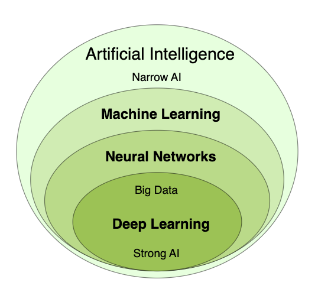

# Machine Learning

  - [Perceptrons](#perceptrons)
  - [Neural Networks](#neural-networks)
  - [Deep Neural Networks](#deep-neural-networks)
  - [Epoch and Batch in Machine Learning](#epoch-and-batch-in-machine-learning)
  - [Neural Networks Examples](#neural-networks-examples)

  Traditional programming uses known algorithms to produce results from data:
  
  Data + Algorithms = Results
  
  Machine learning creates new algorithms from data and results:
  
  Data + Results = Algorithms
  
  
  
  Artificial Intelligence (AI) is an umbrella term for computer software that mimics human cognition in order to perform complex tasks and learn from them.
  
  Machine learning (ML) is a subfield of AI that uses algorithms trained on data to produce adaptable models that can perform a variety of complex tasks.
  
  Deep learning is a subset of machine learning that uses several layers within neural networks to do some of the most complex ML tasks without any human intervention.
  
  In order to understand how ML works, firstly we need to learn how neural networks work.
  
  ### Perceptrons
  
  The Perceptron is the simplest form of a neural network. It consists of a single neuron with one input layer and no hidden layers.
  
  ### Neural Networks
  
  Neural Networks are made up of multiple layers of perceptrons. Each layer helps the network handle more complex problems by breaking them down into smaller steps.
  
  
  
  The yellow nodes are the first layer, where simple decisions are made based on the input. These decisions are then passed along to the next layer. The blue nodes continue processing the information, combining everything to reach a more accurate final result.
  
  ### Deep Neural Networks
  
  Deep Neural Networks are made up of many layers stacked together. Each extra layer helps the network make even smarter and more detailed decisions.
  
  ### Epoch and Batch in Machine Learning
  
  In machine learning, an epoch means the model has seen all the training data once.

  Since the data can be too large to handle at once, we split it into smaller groups called batches. The model learns from one batch at a time.

  Example:

  Imagine you have 200 pictures to train a model. You decide to split them into batches of 5 pictures.

  - That means you have 40 batches (because 200 ÷ 5 = 40).

  - The model looks at one batch at a time and updates itself after each one.

  - After finishing all 40 batches, the model has seen all 200 pictures once — this is called 1 epoch.

  If you train for 1000 epochs, the model repeats this process 1000 times:

  - It will go through all 200 pictures, batch by batch, 1000 times.

  - Each time it learns a little more and tries to improve.
  
  ### Neural Networks Examples
  
  We will be using some JavaScript libraries to hide the complexity of the mathematics in order to use ML and AI. Yet understanding the basics will help to use those libraries.
  
  - [How to build a Neural Network with brain.js](./samples/brainjs/app.js)
  - [How to build a Neural Network with ml5js](./samples/ml5/app.js)

  ## References

- [W3Schools](https://www.w3schools.com/ai/default.asp)
- [coursera](https://www.coursera.org/articles/what-is-deep-learning)