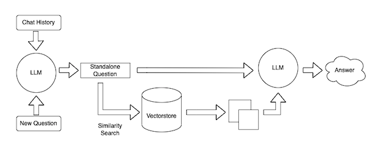

# LangChain

- [Storing vectors HNSWLib](#storing-vectors-hnswlib)
- [Retrieval Chain](#retrieval-chain)

LangChain is a framework for developing applications powered by language models. OpenAI is already good enough for working with models but thats not always easy to perform complex tasks. LangChain provides number of tools, helpers and even vector memory to build our AI based application in a simple way.

Check out [the example](./samples/basic/index.js) which does the same thing as OpenAI first example.

But this time, we do not have to deal with response structure. The response is much more simpler than the one provided by OpenAI. Even the request parameter is a simply string rather than an object.

If you need to construct complext prompt with system and user, you can still do so. See [example](./samples/roles/index.js)

### Storing vectors HNSWLib

HNSWLib is an in-memory vectorstore that can be saved to a file.

Together with LangChain we will store APPLE stock prices for the last 2 years.

Once vector is generated, we can perform basic operations such as similarity search.

See [Example](./samples/vector/save-vector.js)

We have saved the vector for the upcoming examples.

### Retrieval Chain

Retrieval is useful when you have too much data to pass to the LLM directly. You can then use a retriever to fetch only the most relevant pieces and pass those in. This chain invokes similarity search on the documents and pass those documents into our prompt. See img:

From the previous example, we have generated our vectors and store them locally. Now we will use the vector data to give a context for our prompt.

Check [example](./samples/vector/vector-use.js)