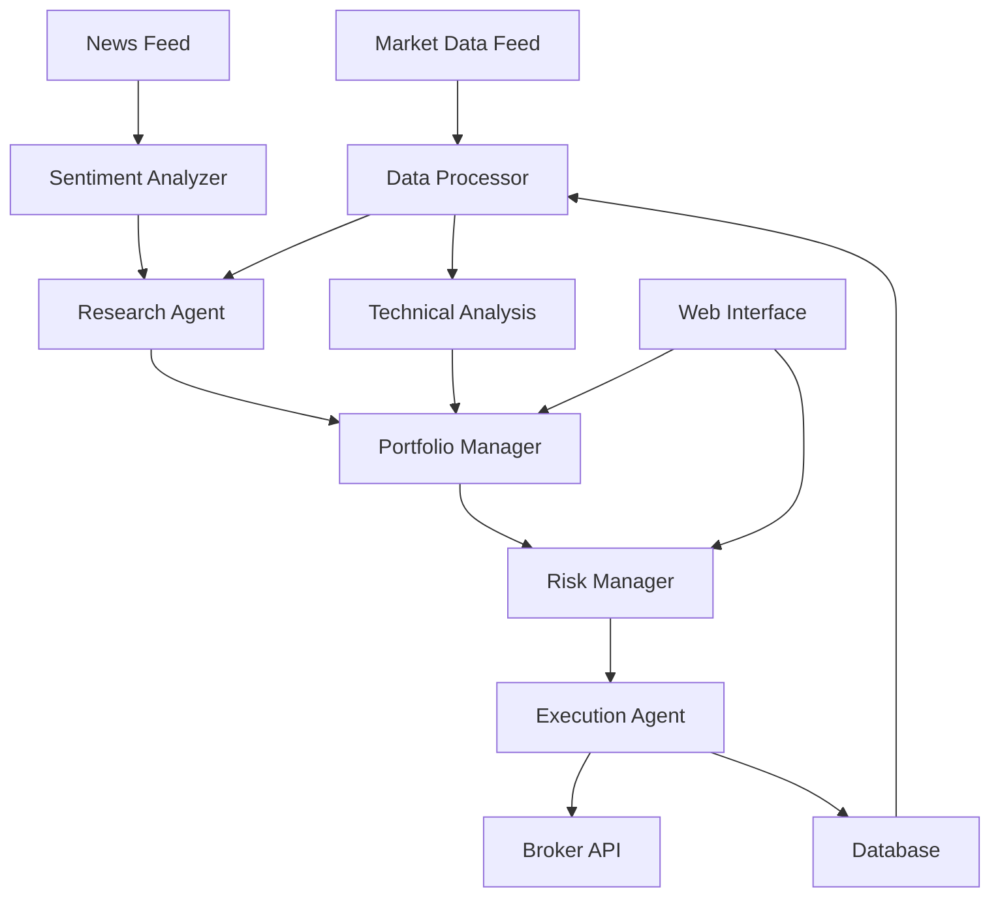

# AI Hedge Fund - Intelligent Trading System

- [Overview](#overview)
- [Key Features](#key-features)
- [Architecture](#architecture)
- [Installation](#installation)
- [Configuration](#configuration)
- [Getting Started](#getting-started)
- [Trading Strategies](#trading-strategies)
- [Risk Management](#risk-management)
- [API Reference](#api-reference)
- [Monitoring and Analytics](#monitoring-and-analytics)

## Overview

AI Hedge Fund is an open-source artificial intelligence-powered trading system that simulates a hedge fund operation using advanced AI agents, market analysis, and automated trading strategies. It demonstrates how AI can be applied to financial markets for investment decision-making and portfolio management.

**Key Characteristics:**
- **AI-Driven**: Uses large language models and AI agents for market analysis
- **Multi-Agent System**: Different AI agents handle various aspects of trading
- **Research-Focused**: Combines fundamental and technical analysis
- **Risk-Aware**: Built-in risk management and position sizing
- **Educational**: Designed for learning about AI in finance

## Key Features

### 1. AI Agent System
- **Research Agent**: Analyzes market news and financial data
- **Portfolio Manager**: Makes investment decisions and allocation
- **Risk Manager**: Monitors and controls portfolio risk
- **Execution Agent**: Handles trade execution and order management

### 2. Market Analysis
- Real-time news sentiment analysis
- Technical indicator computation
- Fundamental analysis integration
- Market regime detection

### 3. Trading Strategies
- Momentum-based strategies
- Mean reversion algorithms
- Sentiment-driven trading
- Multi-factor models

### 4. Risk Management
- Position sizing algorithms
- Stop-loss mechanisms
- Portfolio diversification
- Volatility-based risk controls

### 5. Backtesting and Simulation
- Historical performance analysis
- Strategy optimization
- Monte Carlo simulations
- Performance attribution

## Architecture

### System Components



### Agent Interactions
- **Data Flow**: Market data → Analysis → Decision → Execution
- **Feedback Loops**: Performance results feed back to strategy refinement
- **Risk Controls**: All decisions pass through risk management layer

## Installation

### Prerequisites
```bash
# Python 3.8 or higher
python --version

# Required system packages
pip install --upgrade pip

# Git for cloning
git --version
```

### Quick Setup
```bash
# Clone the repository
git clone https://github.com/virattt/ai-hedge-fund.git
cd ai-hedge-fund

# Create virtual environment
python -m venv venv
source venv/bin/activate  # On Windows: venv\Scripts\activate

# Install dependencies
pip install -r requirements.txt

# Set up environment variables
cp .env.example .env
# Edit .env with your API keys
```

### Docker Installation
```bash
# Build and run with Docker
docker build -t ai-hedge-fund .
docker run -p 8000:8000 --env-file .env ai-hedge-fund

# Or use Docker Compose
docker-compose up -d
```

### Development Setup
```bash
# Install development dependencies
pip install -r requirements-dev.txt

# Install pre-commit hooks
pre-commit install

# Run tests
pytest tests/

# Start development server
python main.py --dev
```

## Configuration

### Environment Variables
```bash
# .env file configuration

# API Keys
OPENAI_API_KEY=your-openai-api-key
ANTHROPIC_API_KEY=your-anthropic-api-key

# Market Data
ALPHA_VANTAGE_API_KEY=your-alpha-vantage-key
POLYGON_API_KEY=your-polygon-key
FINNHUB_API_KEY=your-finnhub-key

# News APIs
NEWS_API_KEY=your-news-api-key
NEWSDATA_API_KEY=your-newsdata-key

# Broker APIs (for live trading)
ALPACA_API_KEY=your-alpaca-key
ALPACA_SECRET_KEY=your-alpaca-secret
ALPACA_BASE_URL=https://paper-api.alpaca.markets  # Paper trading

# Database
DATABASE_URL=sqlite:///hedge_fund.db
REDIS_URL=redis://localhost:6379

# Risk Management
MAX_POSITION_SIZE=0.05  # 5% max position size
MAX_PORTFOLIO_RISK=0.15  # 15% max portfolio risk
STOP_LOSS_THRESHOLD=0.08  # 8% stop loss

# Logging
LOG_LEVEL=INFO
LOG_FILE=logs/hedge_fund.log
```

### Agent Configuration
```python
# config/agents.py

AGENT_CONFIG = {
    'research_agent': {
        'model': 'gpt-4',
        'temperature': 0.3,
        'max_tokens': 2000,
        'system_prompt': 'You are a financial research analyst...',
        'tools': ['news_analyzer', 'financial_calculator', 'web_search']
    },
    
    'portfolio_manager': {
        'model': 'gpt-4',
        'temperature': 0.2,
        'max_tokens': 1500,
        'system_prompt': 'You are an experienced portfolio manager...',
        'tools': ['portfolio_optimizer', 'risk_calculator']
    },
    
    'risk_manager': {
        'model': 'gpt-3.5-turbo',
        'temperature': 0.1,
        'max_tokens': 1000,
        'system_prompt': 'You are a risk management expert...',
        'tools': ['var_calculator', 'correlation_analyzer']
    }
}

TRADING_CONFIG = {
    'universe': ['AAPL', 'GOOGL', 'MSFT', 'AMZN', 'TSLA', 'META', 'NVDA'],
    'rebalance_frequency': 'daily',
    'max_positions': 10,
    'min_cash_buffer': 0.05,  # 5% cash buffer
    'transaction_costs': 0.001  # 0.1% transaction cost
}
```

## Getting Started

### Basic Usage

#### Initialize the Hedge Fund
```python
from ai_hedge_fund import HedgeFund
from ai_hedge_fund.config import load_config

# Load configuration
config = load_config('config/settings.yaml')

# Initialize the hedge fund
hedge_fund = HedgeFund(config)

# Start the trading system
await hedge_fund.start()

# Run for one trading day
result = await hedge_fund.run_trading_session()
print(f"Trading session result: {result}")
```

#### Manual Market Analysis
```python
from ai_hedge_fund.agents import ResearchAgent
from ai_hedge_fund.data import MarketDataProvider

# Initialize components
data_provider = MarketDataProvider()
research_agent = ResearchAgent()

# Analyze a specific stock
symbol = "AAPL"
market_data = await data_provider.get_stock_data(symbol, days=30)
news_data = await data_provider.get_news(symbol, days=7)

# Get AI analysis
analysis = await research_agent.analyze_stock(
    symbol=symbol,
    market_data=market_data,
    news_data=news_data
)

print(f"Analysis for {symbol}:")
print(f"Sentiment: {analysis.sentiment}")
print(f"Recommendation: {analysis.recommendation}")
print(f"Target Price: ${analysis.target_price:.2f}")
print(f"Reasoning: {analysis.reasoning}")
```

#### Portfolio Management
```python
from ai_hedge_fund.portfolio import Portfolio
from ai_hedge_fund.agents import PortfolioManager

# Initialize portfolio
portfolio = Portfolio(initial_capital=100000)

# Add some positions
portfolio.add_position("AAPL", shares=50, price=150.0)
portfolio.add_position("GOOGL", shares=20, price=140.0)
portfolio.add_position("MSFT", shares=30, price=300.0)

# Initialize portfolio manager
pm = PortfolioManager()

# Get rebalancing recommendations
recommendations = await pm.rebalance_portfolio(portfolio)

print("Rebalancing recommendations:")
for rec in recommendations:
    print(f"  {rec.symbol}: {rec.action} {rec.quantity} shares")
    print(f"    Reason: {rec.reasoning}")
```

## Trading Strategies

### Momentum Strategy
```python
from ai_hedge_fund.strategies import MomentumStrategy

class AIEnhancedMomentumStrategy(MomentumStrategy):
    def __init__(self, research_agent):
        super().__init__()
        self.research_agent = research_agent
    
    async def generate_signals(self, universe):
        """Generate trading signals using AI analysis"""
        signals = []
        
        for symbol in universe:
            # Get technical momentum score
            momentum_score = self.calculate_momentum(symbol)
            
            # Get AI sentiment analysis
            ai_analysis = await self.research_agent.quick_analysis(symbol)
            
            # Combine technical and AI signals
            combined_score = self.combine_signals(
                momentum_score, 
                ai_analysis.sentiment_score
            )
            
            if combined_score > 0.7:
                signals.append({
                    'symbol': symbol,
                    'action': 'BUY',
                    'confidence': combined_score,
                    'reasoning': ai_analysis.key_points
                })
            elif combined_score < -0.7:
                signals.append({
                    'symbol': symbol,
                    'action': 'SELL',
                    'confidence': abs(combined_score),
                    'reasoning': ai_analysis.key_points
                })
        
        return signals
    
    def combine_signals(self, technical_score, sentiment_score):
        """Combine technical and sentiment signals"""
        # Weighted combination
        return 0.6 * technical_score + 0.4 * sentiment_score
```

### Mean Reversion Strategy
```python
from ai_hedge_fund.strategies import MeanReversionStrategy
import numpy as np

class AIMeanReversionStrategy(MeanReversionStrategy):
    def __init__(self, research_agent):
        super().__init__()
        self.research_agent = research_agent
        self.lookback_period = 20
    
    async def identify_opportunities(self, universe):
        """Identify mean reversion opportunities with AI validation"""
        opportunities = []
        
        for symbol in universe:
            # Calculate z-score (statistical mean reversion signal)
            prices = self.get_price_history(symbol, self.lookback_period)
            current_price = prices[-1]
            mean_price = np.mean(prices)
            std_price = np.std(prices)
            z_score = (current_price - mean_price) / std_price
            
            # Only consider significant deviations
            if abs(z_score) > 2.0:
                # Get AI validation
                context = f"The stock {symbol} has deviated {z_score:.2f} standard deviations from its {self.lookback_period}-day mean."
                ai_validation = await self.research_agent.validate_reversion(
                    symbol=symbol, 
                    context=context
                )
                
                if ai_validation.is_valid:
                    opportunities.append({
                        'symbol': symbol,
                        'z_score': z_score,
                        'action': 'BUY' if z_score < -2 else 'SELL',
                        'confidence': ai_validation.confidence,
                        'reasoning': ai_validation.reasoning
                    })
        
        return opportunities
```

### News-Driven Strategy
```python
from ai_hedge_fund.strategies import NewsStrategy

class AINewsStrategy(NewsStrategy):
    def __init__(self, research_agent):
        super().__init__()
        self.research_agent = research_agent
    
    async def process_news_event(self, news_item):
        """Process breaking news and generate trading signal"""
        
        # Extract relevant stocks
        affected_stocks = self.extract_stock_mentions(news_item.content)
        
        signals = []
        for symbol in affected_stocks:
            # Get detailed AI analysis of the news impact
            analysis = await self.research_agent.analyze_news_impact(
                symbol=symbol,
                news=news_item,
                market_context=self.get_market_context(symbol)
            )
            
            if analysis.impact_score > 0.5:  # Significant impact threshold
                signals.append({
                    'symbol': symbol,
                    'action': 'BUY' if analysis.impact_direction > 0 else 'SELL',
                    'urgency': analysis.urgency,
                    'time_horizon': analysis.time_horizon,
                    'reasoning': analysis.detailed_reasoning
                })
        
        return signals
    
    def extract_stock_mentions(self, text):
        """Extract stock symbols mentioned in news text"""
        # Implementation to extract ticker symbols
        import re
        pattern = r'\b[A-Z]{2,5}\b'  # Simple pattern for stock symbols
        return re.findall(pattern, text)
```

## Risk Management

### Position Sizing
```python
from ai_hedge_fund.risk import PositionSizer

class AIPositionSizer(PositionSizer):
    def __init__(self, risk_agent):
        super().__init__()
        self.risk_agent = risk_agent
    
    async def calculate_position_size(self, symbol, signal, portfolio):
        """Calculate optimal position size using AI risk assessment"""
        
        # Base position sizing using Kelly Criterion
        kelly_size = self.kelly_criterion(
            win_prob=signal.confidence,
            win_loss_ratio=signal.expected_return / signal.expected_loss
        )
        
        # Get AI risk assessment
        risk_assessment = await self.risk_agent.assess_position_risk(
            symbol=symbol,
            proposed_size=kelly_size,
            portfolio=portfolio,
            market_conditions=self.get_market_conditions()
        )
        
        # Adjust position size based on AI assessment
        adjusted_size = kelly_size * risk_assessment.adjustment_factor
        
        # Apply hard limits
        max_position = portfolio.total_value * self.max_position_pct
        final_size = min(adjusted_size, max_position)
        
        return {
            'position_size': final_size,
            'reasoning': risk_assessment.reasoning,
            'risk_factors': risk_assessment.identified_risks
        }
    
    def kelly_criterion(self, win_prob, win_loss_ratio):
        """Calculate Kelly optimal position size"""
        if win_loss_ratio <= 0:
            return 0
        return max(0, win_prob - (1 - win_prob) / win_loss_ratio)
```

### Portfolio Risk Monitoring
```python
from ai_hedge_fund.risk import RiskMonitor
import numpy as np

class AIRiskMonitor(RiskMonitor):
    def __init__(self, risk_agent):
        super().__init__()
        self.risk_agent = risk_agent
    
    async def daily_risk_check(self, portfolio):
        """Perform comprehensive daily risk assessment"""
        
        # Calculate standard risk metrics
        portfolio_var = self.calculate_var(portfolio)
        max_drawdown = self.calculate_max_drawdown(portfolio)
        beta = self.calculate_portfolio_beta(portfolio)
        
        # Get AI risk interpretation
        risk_report = await self.risk_agent.interpret_risk_metrics(
            var=portfolio_var,
            max_drawdown=max_drawdown,
            beta=beta,
            portfolio=portfolio
        )
        
        # Check for risk limit breaches
        breaches = self.check_risk_limits(portfolio)
        
        if breaches or risk_report.concern_level > 0.7:
            # Generate risk mitigation recommendations
            recommendations = await self.risk_agent.recommend_risk_mitigation(
                portfolio=portfolio,
                breaches=breaches,
                market_conditions=self.get_market_conditions()
            )
            
            return {
                'status': 'WARNING',
                'risk_level': risk_report.concern_level,
                'issues': breaches + risk_report.concerns,
                'recommendations': recommendations
            }
        
        return {
            'status': 'OK',
            'risk_level': risk_report.concern_level,
            'summary': risk_report.summary
        }
    
    def calculate_var(self, portfolio, confidence=0.05, days=1):
        """Calculate Value at Risk"""
        returns = portfolio.get_daily_returns()
        return np.percentile(returns, confidence * 100) * np.sqrt(days)
```

## API Reference

### Core Classes

#### HedgeFund
```python
class HedgeFund:
    def __init__(self, config: dict):
        """Initialize the hedge fund system"""
        pass
    
    async def start(self) -> None:
        """Start all agents and data feeds"""
        pass
    
    async def run_trading_session(self) -> dict:
        """Execute one complete trading session"""
        pass
    
    async def get_portfolio_status(self) -> dict:
        """Get current portfolio status"""
        pass
    
    async def emergency_stop(self) -> None:
        """Emergency stop all trading activities"""
        pass
```

#### Agents

##### ResearchAgent
```python
class ResearchAgent:
    async def analyze_stock(self, symbol: str, **kwargs) -> Analysis:
        """Comprehensive stock analysis"""
        pass
    
    async def analyze_news_impact(self, symbol: str, news: NewsItem) -> Impact:
        """Analyze news impact on stock"""
        pass
    
    async def market_regime_analysis(self) -> MarketRegime:
        """Determine current market regime"""
        pass
```

##### PortfolioManager
```python
class PortfolioManager:
    async def rebalance_portfolio(self, portfolio: Portfolio) -> List[Recommendation]:
        """Generate rebalancing recommendations"""
        pass
    
    async def optimize_allocation(self, signals: List[Signal]) -> Allocation:
        """Optimize portfolio allocation"""
        pass
    
    async def evaluate_performance(self, portfolio: Portfolio) -> Performance:
        """Evaluate portfolio performance"""
        pass
```

#### Data Types
```python
@dataclass
class Analysis:
    symbol: str
    sentiment: float
    recommendation: str
    target_price: float
    reasoning: str
    confidence: float

@dataclass
class Signal:
    symbol: str
    action: str  # BUY, SELL, HOLD
    confidence: float
    reasoning: str
    time_horizon: str
    expected_return: float
    expected_loss: float

@dataclass
class RiskAssessment:
    concern_level: float
    concerns: List[str]
    recommendations: List[str]
    adjustment_factor: float
```

### REST API Endpoints

```python
# FastAPI endpoints

@app.get("/portfolio/status")
async def get_portfolio_status():
    """Get current portfolio status"""
    return await hedge_fund.get_portfolio_status()

@app.post("/portfolio/rebalance")
async def trigger_rebalance():
    """Trigger portfolio rebalancing"""
    return await hedge_fund.rebalance()

@app.get("/analysis/{symbol}")
async def get_stock_analysis(symbol: str):
    """Get AI analysis for a specific stock"""
    return await hedge_fund.research_agent.analyze_stock(symbol)

@app.get("/performance/metrics")
async def get_performance_metrics():
    """Get portfolio performance metrics"""
    return await hedge_fund.get_performance_metrics()

@app.post("/trading/emergency_stop")
async def emergency_stop():
    """Emergency stop all trading"""
    return await hedge_fund.emergency_stop()
```

## Monitoring and Analytics

### Performance Dashboard
```python
from ai_hedge_fund.monitoring import PerformanceDashboard
import streamlit as st

class PerformanceDashboard:
    def __init__(self, hedge_fund):
        self.hedge_fund = hedge_fund
    
    def run(self):
        """Run Streamlit dashboard"""
        st.title("AI Hedge Fund Performance Dashboard")
        
        # Portfolio overview
        portfolio_status = self.hedge_fund.get_portfolio_status()
        
        col1, col2, col3 = st.columns(3)
        with col1:
            st.metric("Total Value", f"${portfolio_status['total_value']:,.2f}")
        with col2:
            st.metric("Daily P&L", f"${portfolio_status['daily_pnl']:,.2f}")
        with col3:
            st.metric("Total Return", f"{portfolio_status['total_return']:.2%}")
        
        # Performance chart
        performance_data = self.hedge_fund.get_performance_history()
        st.line_chart(performance_data['cumulative_returns'])
        
        # Current positions
        st.subheader("Current Positions")
        positions = self.hedge_fund.get_positions()
        st.dataframe(positions)
        
        # Recent trades
        st.subheader("Recent Trades")
        trades = self.hedge_fund.get_recent_trades()
        st.dataframe(trades)
        
        # AI Insights
        st.subheader("AI Insights")
        insights = self.hedge_fund.get_latest_insights()
        for insight in insights:
            st.info(insight['message'])

# Run dashboard
if __name__ == "__main__":
    dashboard = PerformanceDashboard(hedge_fund)
    dashboard.run()
```

### Backtesting Framework
```python
from ai_hedge_fund.backtesting import Backtester
import pandas as pd

class Backtester:
    def __init__(self, strategy, start_date, end_date, initial_capital=100000):
        self.strategy = strategy
        self.start_date = start_date
        self.end_date = end_date
        self.initial_capital = initial_capital
    
    async def run_backtest(self):
        """Run historical backtest"""
        
        # Initialize backtest environment
        portfolio = Portfolio(self.initial_capital)
        trade_log = []
        
        date_range = pd.date_range(self.start_date, self.end_date, freq='D')
        
        for date in date_range:
            if self.is_trading_day(date):
                # Get historical data for this date
                market_data = self.get_historical_data(date)
                
                # Generate signals using strategy
                signals = await self.strategy.generate_signals(
                    market_data, portfolio, date
                )
                
                # Execute trades
                for signal in signals:
                    trade = self.execute_backtest_trade(signal, portfolio, date)
                    if trade:
                        trade_log.append(trade)
                
                # Update portfolio value
                portfolio.update_value(date, market_data)
        
        # Calculate performance metrics
        results = self.calculate_performance_metrics(portfolio, trade_log)
        return results
    
    def calculate_performance_metrics(self, portfolio, trades):
        """Calculate comprehensive performance metrics"""
        
        returns = portfolio.get_returns()
        
        metrics = {
            'total_return': portfolio.total_return,
            'annual_return': portfolio.annualized_return,
            'volatility': returns.std() * np.sqrt(252),
            'sharpe_ratio': self.calculate_sharpe_ratio(returns),
            'max_drawdown': self.calculate_max_drawdown(portfolio),
            'win_rate': len([t for t in trades if t['pnl'] > 0]) / len(trades),
            'profit_factor': self.calculate_profit_factor(trades),
            'num_trades': len(trades)
        }
        
        return {
            'metrics': metrics,
            'trades': trades,
            'equity_curve': portfolio.equity_curve
        }

# Usage
async def run_backtest_example():
    strategy = AIEnhancedMomentumStrategy(research_agent)
    backtester = Backtester(
        strategy=strategy,
        start_date='2023-01-01',
        end_date='2024-01-01',
        initial_capital=100000
    )
    
    results = await backtester.run_backtest()
    
    print(f"Total Return: {results['metrics']['total_return']:.2%}")
    print(f"Sharpe Ratio: {results['metrics']['sharpe_ratio']:.2f}")
    print(f"Max Drawdown: {results['metrics']['max_drawdown']:.2%}")
    print(f"Win Rate: {results['metrics']['win_rate']:.2%}")
```

### Logging and Alerts
```python
import logging
import smtplib
from email.mime.text import MIMEText

class TradingLogger:
    def __init__(self, config):
        self.config = config
        self.setup_logging()
        self.setup_alerts()
    
    def setup_logging(self):
        """Setup comprehensive logging"""
        
        # Main logger
        self.logger = logging.getLogger('hedge_fund')
        self.logger.setLevel(logging.INFO)
        
        # File handler
        fh = logging.FileHandler('logs/hedge_fund.log')
        fh.setLevel(logging.INFO)
        
        # Console handler
        ch = logging.StreamHandler()
        ch.setLevel(logging.WARNING)
        
        # Formatter
        formatter = logging.Formatter(
            '%(asctime)s - %(name)s - %(levelname)s - %(message)s'
        )
        fh.setFormatter(formatter)
        ch.setFormatter(formatter)
        
        self.logger.addHandler(fh)
        self.logger.addHandler(ch)
    
    def log_trade(self, trade):
        """Log trade execution"""
        self.logger.info(f"TRADE: {trade['action']} {trade['quantity']} {trade['symbol']} @ ${trade['price']:.2f}")
    
    def log_signal(self, signal):
        """Log trading signal"""
        self.logger.info(f"SIGNAL: {signal['action']} {signal['symbol']} (confidence: {signal['confidence']:.2f})")
    
    def log_error(self, error, context=""):
        """Log error with context"""
        self.logger.error(f"ERROR {context}: {str(error)}")
    
    def send_alert(self, subject, message, level="INFO"):
        """Send email alert for important events"""
        if level in self.config['alert_levels']:
            try:
                msg = MIMEText(message)
                msg['Subject'] = f"AI Hedge Fund Alert: {subject}"
                msg['From'] = self.config['email_from']
                msg['To'] = self.config['email_to']
                
                server = smtplib.SMTP(self.config['smtp_server'])
                server.send_message(msg)
                server.quit()
                
            except Exception as e:
                self.logger.error(f"Failed to send alert: {str(e)}")

# Usage
logger = TradingLogger(config)
logger.log_trade({
    'action': 'BUY',
    'symbol': 'AAPL',
    'quantity': 100,
    'price': 150.25
})

logger.send_alert(
    "Large Position Opened",
    "Opened large position in AAPL based on strong AI signal",
    "WARNING"
)
```

## Best Practices

### Risk Management
1. **Position Sizing**: Never risk more than 2-3% on a single trade
2. **Diversification**: Maintain positions across multiple sectors
3. **Stop Losses**: Implement both technical and time-based stops
4. **Correlation Monitoring**: Avoid highly correlated positions

### AI Model Management
1. **Model Validation**: Regularly validate AI predictions against outcomes
2. **Ensemble Methods**: Use multiple models for critical decisions
3. **Fallback Systems**: Have non-AI fallbacks for critical functions
4. **Continuous Learning**: Update models based on performance

### System Operations
1. **Monitoring**: Implement comprehensive system monitoring
2. **Backup Systems**: Have redundant systems for critical operations
3. **Testing**: Thorough backtesting before strategy deployment
4. **Documentation**: Maintain detailed logs and documentation

## Disclaimer

**⚠️ Important Legal and Financial Disclaimer ⚠️**

This AI Hedge Fund system is designed for **educational and research purposes only**. It is not intended for actual financial trading or investment decisions. 

- **No Investment Advice**: Nothing in this system constitutes financial, investment, or trading advice
- **Risk Warning**: Trading financial instruments involves substantial risk and may result in significant losses
- **Paper Trading**: Always use paper trading or simulation mode for testing
- **Regulatory Compliance**: Ensure compliance with all applicable financial regulations in your jurisdiction
- **Professional Consultation**: Consult with qualified financial professionals before making investment decisions

The creators and contributors of this project are not responsible for any financial losses incurred through the use of this software.

## Community and Resources

- **GitHub Repository**: [virattt/ai-hedge-fund](https://github.com/virattt/ai-hedge-fund)
- **Documentation**: Comprehensive guides and tutorials
- **Community Forum**: Discussions and support
- **Research Papers**: Academic research on AI in finance

This tool provides a fascinating glimpse into how AI can be applied to financial markets while emphasizing the importance of risk management and regulatory compliance.